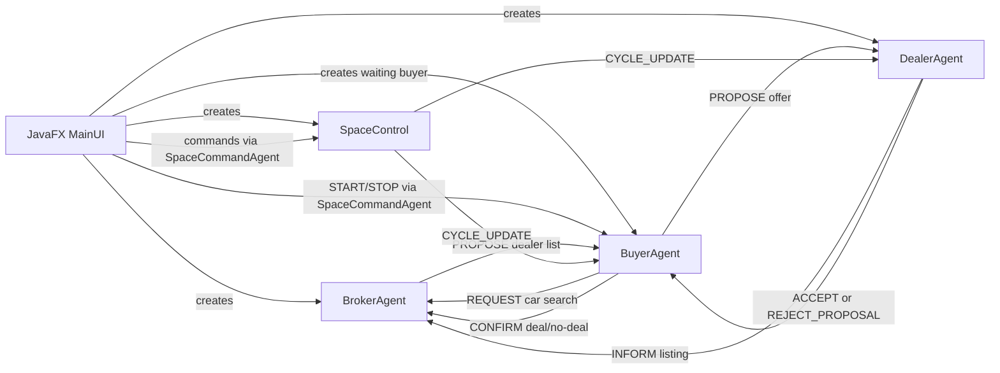
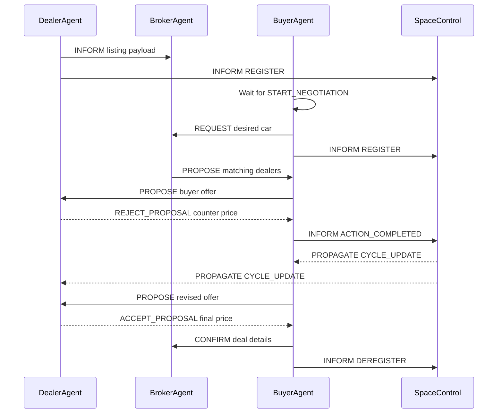
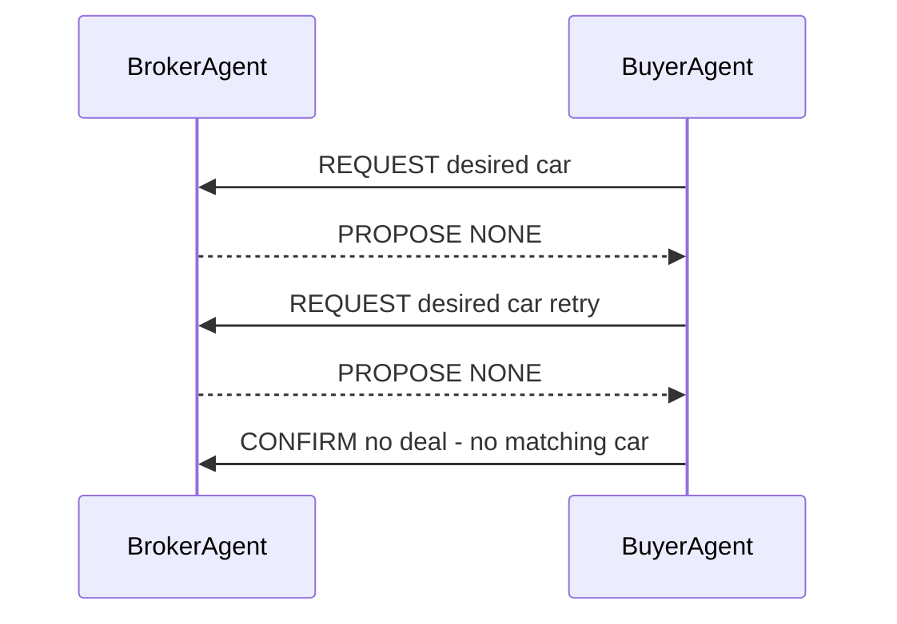
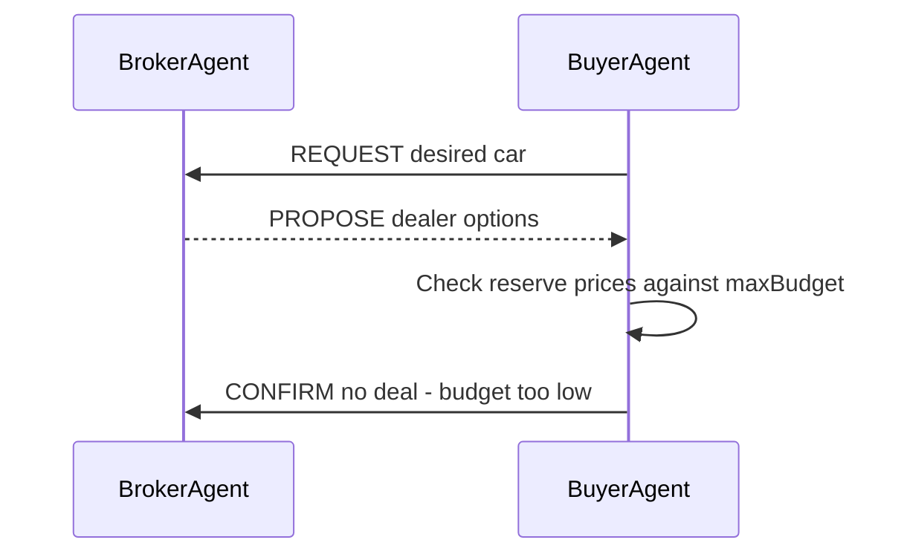

# Automated Car Negotiation System

This project is a JADE-based multi-agent car marketplace. Dealer agents list cars, buyer agents search for matching cars, the broker agent matches buyers to dealers and records outcomes, and a space-control agent manages negotiation cycles. A JavaFX interface is used to create agents, configure negotiation strategies, control the simulation, and view logs/metrics.

## Project Goals

- Simulate autonomous buyer-dealer negotiation using JADE agents.
- Show real ACL messages between agents using the JADE Sniffer.
- Compare different time-based negotiation strategies such as Boulware, Conceder, and Linear.
- Record performance data such as deal count, no-deal count, average deal price, average rounds, and success rate.
- Handle edge cases gracefully instead of letting agents loop forever.

## Setup Instructions

### Prerequisites

- Java 17
- Maven
- JADE 4.6.0 `jade.jar`

### Installation

1. Clone the repository:

   ```bash
   git clone https://github.com/MiyukiVigil/COS30018-Assignment.git
   ```

2. Navigate to the project directory:

   ```bash
   cd COS30018-Assignment
   ```

3. Install dependencies:

   ```bash
   mvn install
   ```

4. If Maven cannot find JADE, place `jade.jar` in the project root and install it locally.

   Linux/macOS:

   ```bash
   mvn install:install-file -Dfile=jade.jar -DgroupId=com.tilab.jade -DartifactId=jade -Dversion=4.6.0 -Dpackaging=jar
   ```

   Windows:

   ```bash
   mvn install:install-file "-Dfile=jade.jar" "-DgroupId=com.tilab.jade" "-DartifactId=jade" "-Dversion=4.6.0" "-Dpackaging=jar"
   ```

## Running the Application

Start the JavaFX application with:

```bash
mvn javafx:run
```

## Demo Flow

1. Register one or more dealer agents in the Dealer Portal.
2. Add buyer agents in the Buyer Portal. Buyers are created in a waiting state and do not negotiate immediately.
3. Alternatively, press `Demo Setup` in the global controls to automatically create a heavier stress-test mix of sample dealers and waiting buyers.
4. Use the global controls above the tabs to manage the demo from any screen.
5. Press `Start` to begin all waiting buyer negotiations.
6. Use `Pause` / `Resume` to control market cycles during the demo.
7. Use `Step Cycle` to manually advance the market one cycle at a time.
8. Use `Sniffer` to open the JADE Sniffer and observe ACL messages.
9. Use `Stop` to terminate active buyer negotiations and record them as `NO_DEAL;USER_STOPPED`.

Demo Agents
----------

The demo setup creates a set of example agents that represent common marketplace roles and negotiation behaviours. Names follow patterns like `DemoAuto*` for dealers and `DemoBuyer*` for buyers; a numeric suffix is appended for each instance (e.g., `DemoAutoA-1`, `DemoBuyerPremium-1`). The demo agents are intended to help exercise different negotiation edge cases:

- `DemoAutoA-*`, `DemoAutoB-*`, `DemoAutoC-*`: Competing Camry dealers with slightly different retail and reserve prices. They demonstrate price competition and how buyers select among multiple similar listings.
- `BudgetCars-*`: A low-cost dealer (e.g., Honda Civic listings) that tests budget-sensitive buyers and mid-range deals.
- `FamilyDrive-*`: A family/SUV-focused dealer (e.g., Honda CR-V) representing higher-priced inventory and buyers with larger budgets.
- `TruckHub-*`: High-end truck dealer (e.g., Toyota Fortuner) to exercise high-budget buyers and extreme counter-offers.

- `DemoBuyerPremium-*`: High-budget buyer who can stretch to pay near retail — useful to validate successful deals and commission calculations.
- `DemoBuyerStubborn-*`: Conservative/boulware-style buyer who concedes slowly; useful to test negotiations that may drag and trigger strategy switching.
- `DemoBuyerTight-*`: Budget-constrained buyer that often results in `NO_DEAL;BUDGET_TOO_LOW` outcomes.
- `DemoBuyerCivic-*`: Buyer specifically targeting lower-priced models (e.g., Civic) to exercise broker search and matching.
- `DemoBuyerSUV-*`: Buyer targeting SUVs (e.g., CR-V) with larger budgets.
- `DemoBuyerStretch-*`: High-budget buyer for expensive models (e.g., Fortuner) that stresses multi-round negotiation for large-ticket items.
- `DemoBuyerBudget-*`: Intentionally underfunded buyer to exercise the no-deal code paths and ensure broker records failures.
- `DemoBuyerOverdrive-*`: Aggressive buyer that may accelerate concessions quickly; useful to test rapid deal closure.

These demo agent archetypes are configurable via the Market Analysis settings; they exist to provide repeatable scenarios for testing strategy behaviour, sniffer visualization, and performance metrics.

## Main Files

| File | Purpose |
| --- | --- |
| `src/main/java/org/example/MainUI.java` | JavaFX GUI, JADE container setup, agent creation, global controls, charts, logs, and negotiation configuration inputs. |
| `src/main/java/org/example/agents/BuyerAgent.java` | Buyer-side search and negotiation logic. Handles waiting/start/stop, offers, dealer fallback, retries, and no-deal cases. |
| `src/main/java/org/example/agents/DealerAgent.java` | Dealer-side listing and negotiation logic. Calculates target sale price and accepts/rejects buyer offers. |
| `src/main/java/org/example/agents/BrokerAgent.java` | Marketplace broker. Stores inventory, answers buyer searches, records transactions and performance metrics. |
| `src/main/java/org/example/agents/SpaceControl.java` | Cycle manager. Broadcasts market cycle updates and supports pause/resume/step controls. |
| `src/main/java/org/example/agents/SpaceCommandAgent.java` | Short-lived helper agent used by the UI to send ACL commands into the JADE platform. |
| `src/main/java/org/example/agents/NegotiationConfig.java` | Shared configuration object for strategy, deadline, reserve price, starting offer, retries, and round limits. |

## User Interface

### Global Controls

The controls above the tabs are available from every screen:

- `Start`: sends `START_NEGOTIATION` to all waiting buyer agents.
- `Demo Setup`: creates a stress-test scenario with 6 dealers and 8 waiting buyers, including competing Camry dealers, cross-model contention, a low-budget failure, and earlier strategy switching.
- `Pause` / `Resume`: sends `PAUSE` or `RESUME` to `SpaceControl`.
- `Stop`: sends `STOP_NEGOTIATION` to buyer agents and records `NO_DEAL;USER_STOPPED`.
- `Step Cycle`: sends `STEP` to `SpaceControl` and advances one cycle immediately.
- `Sniffer`: launches the JADE Sniffer visual message tool.

### Dashboard

Shows system-level information:

- active buyers
- active dealers
- closed deals
- broker revenue
- negotiation price trajectory chart
- setup status messages

### Buyer Portal

Creates buyer agents. A buyer is not started immediately. It waits until the global `Start` button is pressed.

Inputs:

- buyer name
- desired car
- maximum budget

### Dealer Portal

Creates dealer agents and lists inventory with the broker.

Inputs:

- dealer name
- car model
- retail price
- stock quantity

### Market Analysis

Configures negotiation behaviour before creating agents:

- strategy: `BOULWARE`, `CONCEDER`, or `LINEAR`
- deadline cycles
- buyer starting offer percentage
- dealer reserve percentage
- maximum rounds per dealer
- search retry limit
- stuck-round threshold
- manual dealer price adjustment

### Activity Log

Displays filtered system events, including search results, offers, counters, acceptances, no-deal outcomes, revenue, and performance metrics.

## Agent Architecture



## Agent Responsibilities

### BuyerAgent

The buyer agent represents a customer looking for a specific car under a maximum budget.

Main behaviour:

1. Waits until it receives `START_NEGOTIATION`.
2. Sends `REQUEST` to the broker for the desired car.
3. Receives dealer options from the broker.
4. Checks whether any dealer reserve price is within the buyer budget.
5. Sends `PROPOSE` offers to dealers.
6. Handles `REJECT_PROPOSAL` counter-offers.
7. Sends a revised `PROPOSE` if still negotiating.
8. Handles `ACCEPT_PROPOSAL` and confirms the deal to the broker.
9. Sends no-deal confirmation if budget, retry, or round limits are exceeded.

Important state:

- `desiredCar`: requested car model.
- `maxBudget`: maximum amount the buyer can pay.
- `initialOffer`: starting offer based on configured buyer start percentage.
- `currentWillingOffer`: buyer's current cycle-based offer.
- `dealers`: dealer options returned by the broker.
- `negotiationRound`: number of negotiation rounds with the current dealer.
- `searchRetries`: number of broker search retries.
- `negotiationStarted`: controls whether the buyer waits or starts immediately.

### DealerAgent

The dealer agent represents a seller with car stock.

Main behaviour:

1. Registers its car listing with the broker.
2. Registers with `SpaceControl` to receive cycle updates.
3. Calculates a dynamic target price each cycle.
4. Receives buyer `PROPOSE` messages.
5. Accepts if the buyer offer is at least the current target price.
6. Rejects with a counter-offer if the buyer offer is too low.
7. Reduces stock after a successful sale.
8. Terminates when stock reaches zero.

Important state:

- `retailPrice`: initial listed price.
- `minPrice`: reserve price or lowest acceptable price.
- `currentTargetPrice`: current asking target based on the cycle and strategy.
- `stockCount`: remaining stock.
- `manualTargetPrice`: optional manual price override from the UI.

### BrokerAgent

The broker agent acts as the marketplace middleman.

Main behaviour:

1. Receives dealer listings through `INFORM`.
2. Stores car model, dealer name, retail price, reserve price, and stock.
3. Receives buyer search requests through `REQUEST`.
4. Replies with matching dealers using `PROPOSE`.
5. Receives buyer deal/no-deal confirmations through `CONFIRM`.
6. Calculates transaction fee, commission, total revenue, and performance metrics.

Performance metrics logged:

- deals closed
- no-deal count
- average deal price
- average successful negotiation rounds
- success rate

### SpaceControl

`SpaceControl` manages market time.

Main behaviour:

1. Tracks active buyer and dealer agents.
2. Receives `REGISTER` and `DEREGISTER`.
3. Broadcasts `CYCLE_UPDATE` messages.
4. Advances cycles when market actions complete.
5. Supports `PAUSE`, `RESUME`, and `STEP`.

The cycle number is important because buyer and dealer prices are calculated using time-dependent concession formulas.

Automatic cycle advances are delayed slightly so the demonstration is readable in the UI and JADE Sniffer. `Step Cycle` still advances immediately for manual demos.

### SpaceCommandAgent

This is a short-lived helper agent. JavaFX itself is not a JADE agent, so it cannot directly participate in JADE messaging. `SpaceCommandAgent` is created temporarily by the UI to send a single ACL message, then deletes itself.

Examples:

- UI creates `SpaceCommandAgent` to send `PAUSE` to `space`.
- UI creates `SpaceCommandAgent` to send `START_NEGOTIATION` to a buyer.
- UI creates `SpaceCommandAgent` to send `PRICE_ADJUSTMENT` to a dealer.

## ACL Communication Protocol

| Sender | Receiver | Performative | Ontology | Content | Meaning |
| --- | --- | --- | --- | --- | --- |
| Dealer | Broker | `INFORM` | empty | `car;retailPrice;stock;reservePrice` | Dealer lists inventory. |
| Buyer | Broker | `REQUEST` | empty | `desiredCar` | Buyer searches for matching car. |
| Broker | Buyer | `PROPOSE` | empty | `dealer:price:reserve,...` or `NONE` | Broker returns matching dealers. |
| Buyer | Dealer | `PROPOSE` | empty | `offerPrice` | Buyer makes an offer. |
| Dealer | Buyer | `REJECT_PROPOSAL` | empty | `currentTargetPrice` | Dealer rejects and counter-offers. |
| Dealer | Buyer | `ACCEPT_PROPOSAL` | empty | `acceptedPrice` | Dealer accepts buyer offer. |
| Buyer | Broker | `CONFIRM` | empty | `price;dealer;car;rounds` | Buyer confirms successful deal. |
| Buyer | Broker | `CONFIRM` | empty | `NO_DEAL;reason;car;budget` | Buyer reports failed negotiation. |
| Buyer/Dealer | SpaceControl | `INFORM` | `REGISTER` | empty | Agent joins cycle updates. |
| Buyer/Dealer | SpaceControl | `INFORM` | `DEREGISTER` | empty | Agent leaves cycle updates. |
| Buyer | SpaceControl | `INFORM` | `ACTION_COMPLETED` | empty | Negotiation action completed; cycle may advance. |
| SpaceControl | Buyer/Dealer | `PROPAGATE` | `CYCLE_UPDATE` | `cycleNumber` | Broadcasts new market cycle. |
| UI helper | Buyer | `INFORM` | `START_NEGOTIATION` | empty | Starts waiting buyer. |
| UI helper | Buyer | `INFORM` | `STOP_NEGOTIATION` | empty | Stops buyer negotiation. |
| UI helper | Dealer | `INFORM` | `PRICE_ADJUSTMENT` | `newPrice` | Manually adjusts dealer target price. |

## Sequence Diagrams

### Successful Negotiation



### No Matching Car



### Budget Too Low



## Negotiation Model

The system uses time-dependent concession. A negotiation strategy controls how quickly the buyer and dealer change their prices as the deadline approaches.

Definitions:

| Symbol | Meaning |
| --- | --- |
| `t` | Current cycle age of the negotiation. |
| `T` | Deadline cycles. |
| `beta` | Strategy parameter controlling concession speed. |
| `P_retail` | Dealer retail price. |
| `P_reserve` | Dealer minimum acceptable price. |
| `B_max` | Buyer maximum budget. |
| `B_initial` | Buyer initial offer. |

The normalized time ratio is:

```text
r = t / T
```

The concession factor is:

```text
concessionFactor = r ^ beta
```

Because `r` is between `0` and `1`, different beta values create different concession shapes.

The active beta can change during a negotiation. Agents start with the selected strategy, then switch to the configured second strategy when the local cycle reaches the switch threshold:

```text
effectiveStrategy(t) =
    initialStrategy, if t < switchCycle
    switchStrategy,  if t >= switchCycle

beta = beta(effectiveStrategy(t))
```

Example: the UI default starts with `BOULWARE` and switches to `CONCEDER` at cycle `8`. This keeps agents firm early, then makes them more flexible if negotiation drags on.

## Strategy Values

The strategy values are defined in `NegotiationConfig.java`.

| Strategy | Beta | Behaviour |
| --- | ---: | --- |
| `BOULWARE` | `2.0` | Concedes slowly at the beginning and faster near the deadline. |
| `CONCEDER` | `0.45` | Concedes quickly at the beginning. |
| `LINEAR` | `1.0` | Concedes at a constant rate. |

### Why Beta Changes Behaviour

For early cycle time, such as `r = 0.2`:

```text
Boulware: 0.2 ^ 2.0  = 0.04
Linear:   0.2 ^ 1.0  = 0.20
Conceder: 0.2 ^ 0.45 = about 0.48
```

This means Boulware only makes about 4% of its total concession early, while Conceder makes about 48%. That is why Boulware is firm early and Conceder gives in quickly.

## Dealer Formula

The dealer starts near the retail price and gradually moves down toward the reserve price.

```text
DealerTarget(t) = P_retail - (P_retail - P_reserve) * (t / T) ^ beta
```

In code:

```java
double concessionFactor = Math.pow((double) t / config.getDeadlineCycles(), config.beta());
int cycleTarget = (int) (retailPrice - ((retailPrice - minPrice) * concessionFactor));
currentTargetPrice = Math.max(minPrice, cycleTarget);
```

Interpretation:

- At `t = 0`, the target is close to `P_retail`.
- At `t = T`, the target reaches `P_reserve`.
- The dealer never goes below reserve price.
- If the UI sends a manual price adjustment, the dealer uses that target while still protecting the reserve price.

Example:

```text
Retail price: RM100,000
Reserve price: RM70,000
Deadline: 50 cycles
Current cycle: 10
Strategy: Boulware beta = 2.0

r = 10 / 50 = 0.2
concessionFactor = 0.2 ^ 2 = 0.04
DealerTarget = 100,000 - (100,000 - 70,000) * 0.04
DealerTarget = 100,000 - 30,000 * 0.04
DealerTarget = RM98,800
```

With Conceder:

```text
concessionFactor = 0.2 ^ 0.45 = about 0.48
DealerTarget = 100,000 - 30,000 * 0.48
DealerTarget = about RM85,600
```

So the Conceder dealer lowers price much faster.

## Buyer Formula

The buyer starts from a lower initial offer and gradually increases toward the maximum budget.

```text
BuyerOffer(t) = B_initial + (B_max - B_initial) * (t / T) ^ beta
```

In code:

```java
double concessionFactor = Math.pow((double) t / config.getDeadlineCycles(), config.beta());
currentWillingOffer = (int) (initialOffer + ((maxBudget - initialOffer) * concessionFactor));
currentWillingOffer = Math.min(currentWillingOffer, maxBudget);
```

Interpretation:

- At `t = 0`, the buyer starts around `B_initial`.
- At `t = T`, the buyer reaches `B_max`.
- The buyer never offers more than the maximum budget.

Example:

```text
Maximum budget: RM90,000
Initial offer: 70% of budget = RM63,000
Deadline: 50 cycles
Current cycle: 10
Strategy: Boulware beta = 2.0

r = 10 / 50 = 0.2
concessionFactor = 0.2 ^ 2 = 0.04
BuyerOffer = 63,000 + (90,000 - 63,000) * 0.04
BuyerOffer = 63,000 + 27,000 * 0.04
BuyerOffer = RM64,080
```

With Conceder:

```text
concessionFactor = 0.2 ^ 0.45 = about 0.48
BuyerOffer = 63,000 + 27,000 * 0.48
BuyerOffer = about RM75,960
```

So the Conceder buyer increases their offer much faster.

## Deal Decision Rule

A dealer accepts when:

```text
BuyerOffer >= DealerTarget
```

If true:

- Dealer sends `ACCEPT_PROPOSAL`.
- Buyer sends `CONFIRM` to Broker.
- Broker records the transaction.
- Dealer stock decreases by one.

If false:

- Dealer sends `REJECT_PROPOSAL`.
- The reject content contains the dealer's current target price as a counter-offer.
- Buyer decides whether to continue, accelerate, move to another dealer, or report no deal.

## Stuck Negotiation Rule

The buyer has a configurable `stuckRoundsBeforeAcceleration` setting. If the dealer keeps rejecting and the round count reaches the threshold, the buyer moves faster toward the maximum budget.

Code logic:

```java
currentWillingOffer = Math.min(
    maxBudget,
    currentWillingOffer + Math.max(1, (maxBudget - currentWillingOffer) / 2)
);
```

This halves the remaining gap between the current offer and maximum budget. It helps prevent long negotiations from dragging indefinitely.

## Dynamic Configuration

`NegotiationConfig` is passed into buyer and dealer agents when they are created.

Configurable values:

- `strategy`: Boulware, Conceder, or Linear.
- `strategySwitchCycle`: cycle number where the agent changes strategy. Use `0` to effectively disable switching.
- `switchStrategy`: strategy used after the switch cycle.
- `deadlineCycles`: maximum cycle value used in formulas.
- `buyerStartPercent`: buyer initial offer percentage.
- `dealerReservePercent`: dealer reserve price percentage.
- `maxRoundsPerDealer`: failed rounds allowed before trying the next dealer.
- `maxSearchRetries`: broker search retries before giving up.
- `stuckRoundsBeforeAcceleration`: round threshold for accelerated buyer concession.

Because configuration is passed during agent creation, you can run different experiments without editing Java code.

## Edge Case Rules

| Edge Case | Behaviour |
| --- | --- |
| Buyer's budget is too low | Buyer checks dealer reserve prices and immediately reports `NO_DEAL;BUDGET_TOO_LOW`. |
| No matching car found | Buyer retries up to the configured retry limit, then reports `NO_DEAL;NO_MATCHING_CAR`. |
| Negotiation stuck | Buyer accelerates concession after the configured stuck-round threshold. |
| Too many failed rounds | Buyer moves to another dealer or reports `NO_DEAL;MAX_ROUNDS_REACHED`. |
| User presses Stop | Buyer reports `NO_DEAL;USER_STOPPED`. |
| Dealer stock reaches zero | Dealer logs out of stock and terminates. |
| New dealer joins mid-simulation | Broker stores the listing, and future buyer searches can find the new dealer. |
| Manual price change | UI sends `PRICE_ADJUSTMENT` to a dealer, and the dealer updates its target price while respecting reserve price. |

## JADE Sniffer

The JADE Sniffer is used to show real ACL messages between agents. It is useful for proving that the system is using agent communication rather than only Java method calls or UI logs.

The app launches Sniffer with a focused preload for `broker`, `space`, and the demo agent name patterns. It avoids sniffing short-lived UI helper agents because those agents delete themselves quickly and can cause JADE AMS warnings.

How to use it:

1. Start the application.
2. Open Sniffer using the global `Sniffer` button if it is not already open.
3. If agents are not shown automatically, manually select the agents you want to observe:
   - `broker`
   - `space`
   - buyer agent names
   - dealer agent names
4. Start negotiation.
5. Watch the arrows between agents.

Expected message arrows:

- Buyer to Broker: `REQUEST`
- Broker to Buyer: `PROPOSE`
- Buyer to Dealer: `PROPOSE`
- Dealer to Buyer: `REJECT_PROPOSAL`
- Dealer to Buyer: `ACCEPT_PROPOSAL`
- Buyer to Broker: `CONFIRM`
- SpaceControl to Buyer/Dealer: `CYCLE_UPDATE`

If the Sniffer window appears empty, close old Sniffer windows, click `Sniffer` again, then start negotiation. If needed, select agents manually in the Sniffer interface before pressing `Start`.

## Performance Metrics

The Broker logs performance after successful and failed negotiations:

```text
PERFORMANCE: Deals=2 | NoDeals=1 | AvgDeal=RM85000 | AvgRounds=2.5 | SuccessRate=66.7%
```

Metric meanings:

| Metric | Meaning |
| --- | --- |
| `Deals` | Number of completed purchases. |
| `NoDeals` | Number of failed negotiations. |
| `AvgDeal` | Average sale price of successful deals. |
| `AvgRounds` | Average negotiation rounds for successful deals. |
| `SuccessRate` | Deals divided by total attempts. |

Broker revenue is calculated as:

```text
BrokerEarning = 50 + (FinalSalePrice * 0.05)
```

Where:

- `RM50` is the fixed transaction fee.
- `5%` is the commission from the final sale price.

## Limitations

- Buyer and dealer strategies are currently symmetric: both use the same selected strategy beta.
- Existing agents keep the configuration they were created with; changing settings affects newly created agents.
- Broker inventory is in memory only and resets when the application restarts.
- The Sniffer is a JADE debugging tool. The app preloads demo/system agents, but custom buyer/dealer names may still require manual selection inside the Sniffer window.

## Summary

This system demonstrates a multi-agent negotiation marketplace using JADE ACL messaging. It includes dynamic negotiation strategies, configurable parameters, cycle-based price concession, UI-controlled start/pause/stop, edge-case handling, performance logging, and Sniffer-based communication visualisation.
